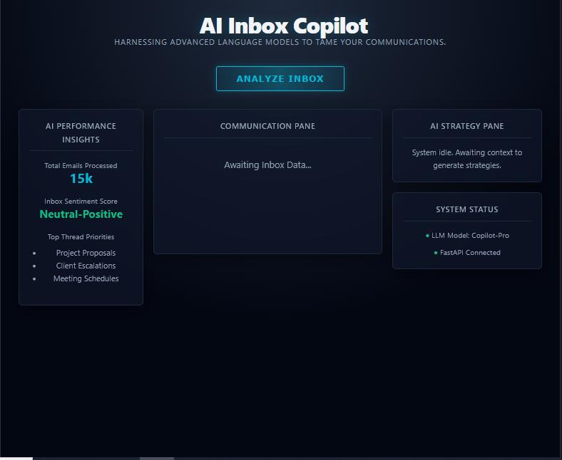
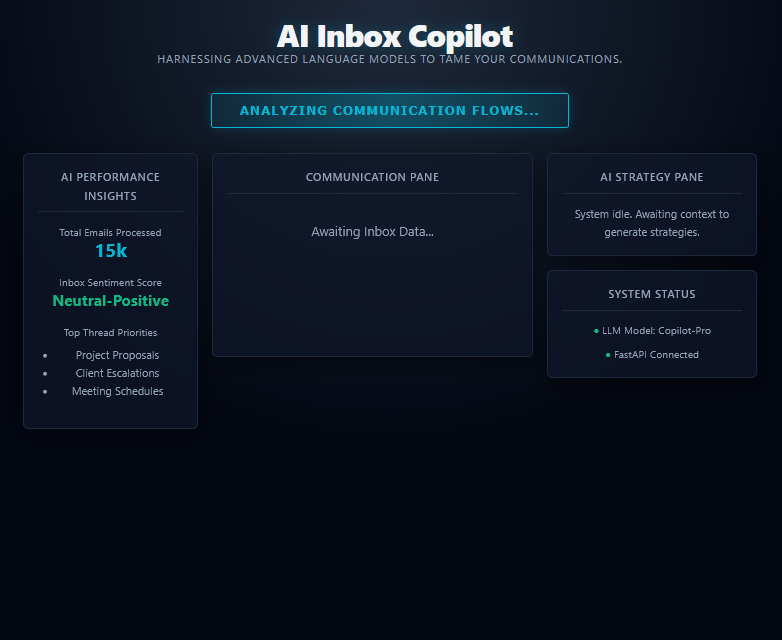
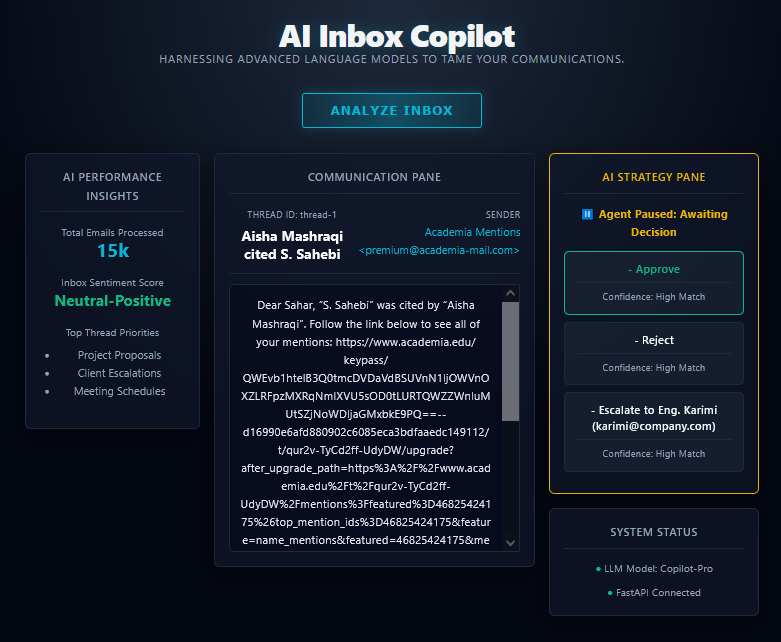
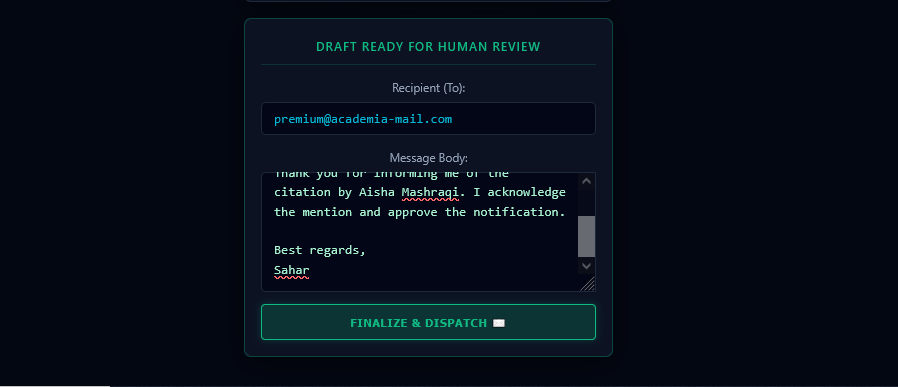
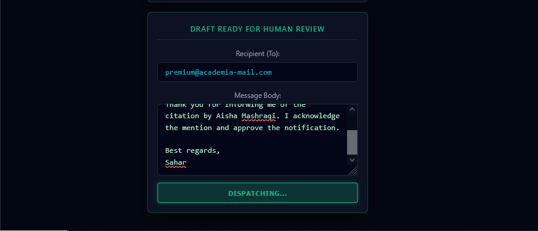

# AI Inbox Copilot: An Agentic Email Management System

This repository contains the source code for an agentic email assistant developed using **FastAPI**, **React**, and **LangGraph**. The system is designed to process incoming emails, propose context-aware action strategies, and generate preliminary response drafts using Large Language Models (LLMs). 

A core component of this system is its **Human-in-the-Loop (HITL)** architecture, which strictly requires human validation and approval before executing any final communication over SMTP protocols.

## System Interfaces

The following images demonstrate the system's user interface and operational workflow:

<div align="center">
  
  <br/>
  <i>Figure 1: The initial system interface displaying aggregate performance metrics while awaiting the command to initiate inbox analysis.</i>
  <br/><br/>
  
  
  <br/>
  <i>Figure 2: The system actively retrieving and processing incoming communication flows.</i>
  <br/><br/>
  
  
  <br/>
  <i>Figure 3: Completion of the analysis phase; the agent pauses to present contextually generated action strategies (e.g., Approve, Reject, Escalate) for human decision-making.</i>
  <br/><br/>

  
  
  <br/>
  <i>Figure 4: The Human-in-the-Loop (HITL) review module, enabling manual verification and modification of both the recipient address and the message body.</i>
  <br/><br/>

  
  <br/>
  <i>Figure 6: Execution of the final dispatch sequence, initiating the transmission of the approved email via SMTP.</i>
</div>


## Key Capabilities

- **Stateful Workflow Management:** Utilizes `LangGraph` (`StateGraph`) to manage the state and transitions of the email evaluation process.
- **Context-Aware Routing:** Integrates a localized organizational chart (CSV format) to accurately route, escalate, or forward emails to relevant departments or personnel.
- **Human-in-the-Loop (HITL) Validation:** The workflow pauses systematically after the initial analysis. It requires explicit user interaction to select a strategy, edit the drafted text, and confirm the recipient's address prior to dispatch.
- **LLM Integration:** Employs the Groq API (utilizing the Llama 3 model) for natural language understanding, classification, and text generation.
- **Standardized Communication Protocols:** Implements `IMAP4_SSL` for secure email retrieval and `SMTP_SSL` for message transmission.

## Technology Stack

**Frontend Environment:**
- React.js (Vite build tool)
- Axios (HTTP client for API requests)
- Custom CSS (Responsive layout with dynamic LTR/RTL text direction support)

**Backend Environment:**
- Python 3.10+
- FastAPI & Uvicorn (Asynchronous ASGI server)
- LangChain & LangGraph (Orchestration framework)
- `langchain-groq` (LLM interface)
- Native Python libraries (`smtplib`, `imaplib`, `email`)

## Installation and Setup

### 1. Prerequisites
- Node.js (v18 or higher recommended)
- Python (v3.10 or higher)
- A registered Groq API Key
- An active email account with application-specific passwords enabled (e.g., Gmail App Passwords).

### 2. Backend Configuration
Navigate to the `backend` directory and initialize the Python virtual environment:
```bash
cd backend
python -m venv venv
source venv/bin/activate  # On Windows systems use: venv\Scripts\activate
pip install -r requirements.txt